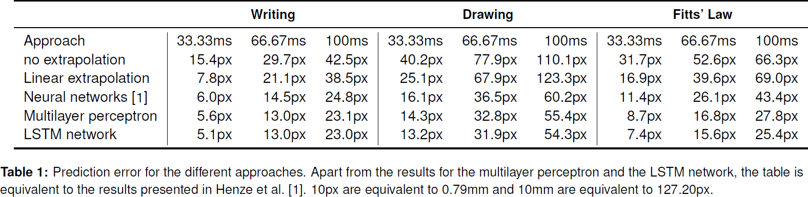

# MobileHCI 2017 - Improving Software-Reduced Touchscreen Latency
Code, model, and data to reproduce the results reported in our [Mobile HCI](https://mobilehci.acm.org/2017) late breaking work "Improving Software-Reduced Touchscreen Latency" by Niels Henze, Huy Viet Le, Sven Mayer, Valentin Schwind.

## Abstract
The latency of current mobile devices' touchscreens is around 100ms and has widely been explored. Latency down to 2ms is noticeable, and latency as low as 25ms reduces users' performance. Previous work reduced touch latency by extrapolating a finger's movement using an ensemble of shallow neural networks and showed that predicting 33ms into the future increases users' performance. Unfortunately, this prediction has a high error. Predicting beyond 33ms did not increase participants' performance, and the error affected the subjective assessment. We use more recent machine learning techniques to reduce the prediction error. We train LSTM networks and multilayer perceptrons using a large data set and regularization. We show that linear extrapolation causes a 116.7% higher error and the previously proposed ensembles of shallow networks causes a 26.7% higher error compared to the LSTM networks. The trained models, the data used for testing, and the source code is available on GitHub.

## Prerequisites
- Python 3.6
- TensorFlow 1.1
- TFLearn 0.3
- ...

## References
[1] Niels Henze, Markus Funk, Alireza Sahami Shirazi: Software-reduced touchscreen latency. Proceedings of the International Conference on Human-Computer Interaction with Mobile Devices and Services, 2016.

[2] Niels Henze, Huy Viet Le, Sven Mayer, Valentin Schwind: Improving Software-Reduced Touchscreen Latency. Adjunct Proceedings of the International Conference on Human-Computer Interaction with Mobile Devices and Services, 2017.
